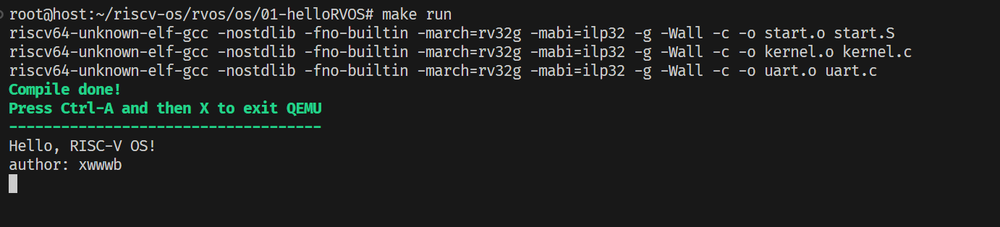

# 基于 RISCV 架构的多任务操作系统开发

github: https://github.com/xwwwb/riscv-os

gitee: https://gitee.com/xwwwb/riscv-os

### 如何运行

使用Ubuntu20.04

20.04及以后的系统都可用

[Ubuntu – 软件包搜索结果 -- gcc-riscv64-unknown-elf](https://packages.ubuntu.com/search?keywords=gcc-riscv64-unknown-elf)

```shell
sudo apt update
sudo apt install build-essential gcc make perl dkms git gcc-riscv64-unknown-elf gdb-multiarch qemu-system-misc
```


### Hello World



### 内存分页

### 协作式多任务

### 陷入 中断 定时器