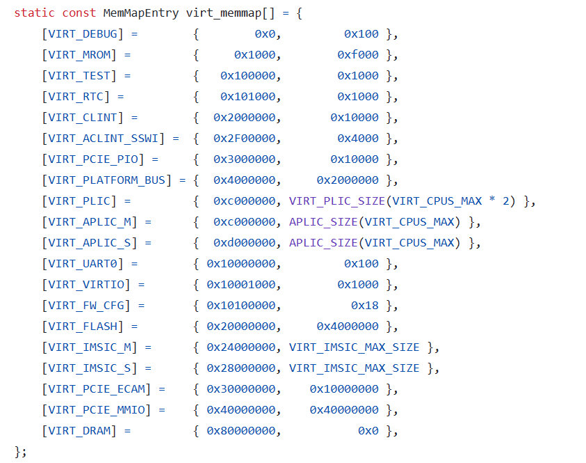

## 关于GCC的参数-Ttext

为什么要在GCC的参数中加入

```
-Ttext=0x80000000
```

因为在QEMU的riscv的board中，本项目使用的是virt

查看virt的地址映射，发现RAM映射地址的起步是0x80000000

链接器要知道链接到哪个地址

[qemu/hw/riscv/virt.c at master · qemu/qemu (github.com)](https://github.com/qemu/qemu/blob/master/hw/riscv/virt.c)



GCC的手册：

[Link Options (Using the GNU Compiler Collection (GCC))](https://gcc.gnu.org/onlinedocs/gcc-13.2.0/gcc/Link-Options.html#index-T)

[Scripts (LD) (sourceware.org)](https://sourceware.org/binutils/docs-2.42/ld/Scripts.html)

## 为什么在QEMU中可以直接加载ELF文件