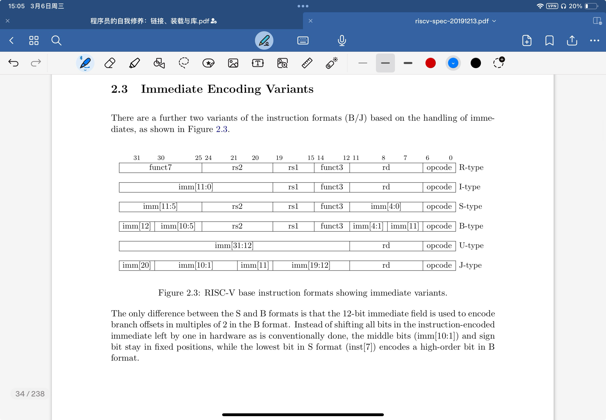

一条典型的RISC-V汇编语句

[label:] [operation] [comment]

方括号表示可选 三个都带方括号表示 支持空行

**label 标号 任何以冒号结尾的标识符都是标号**

label就像是一个地址

**operation 有以下多种类型：**

- instruction 指令 直接对应二进制字符串

- pseudo-instruction 伪指令 为了提高代码效率，可以用一条伪指令指示汇编器产生多条实际的指令

- directive 指示 伪操作 通过类似指令的形式 以.开头 通知汇编器如何控制代码的产生等 不控制代码产生 属于汇编器定义的语法

- macro 采用.macro/.endm自定义的宏 弹幕说 类似于inline

**注释** 常见的方式是#开始到当前行结尾

例子：

```assembly
# First RISC-V Assemble Sample

.macro do_nothing	# directive
	nop		# pseudo-instruction
	nop		# pseudo-instruction
.endm			# directive

	.text		# directive
	.global _start	# directive
_start: 		# Label
	li x6, 5	# pseudo-instruction
	li x7, 4	# pseudo-instruction
	add x5, x6, x7	# instruction
	do_nothing	# Calling macro
stop:	j stop		# statement in one line Label

	.end		# End of file

```

**指令总览**

寄存器有32个通用寄存器

x0-x31 

Hart在执行算数逻辑运算的时候所操作的数据必须来自寄存器




R-type 用于 寄存器—寄存器 操作

I-type 用于 短立即数 和 访存load 操作

S-type 用于 访存store 操作

B-type 用于 条件跳转 操作

U-type 用于 长立即数 操作

J-type 用于 无条件跳转

func3和func7一起决定最终的指令类型

指令在内存中按小端序排列

小端序

多字节数的低位在内存的低位

