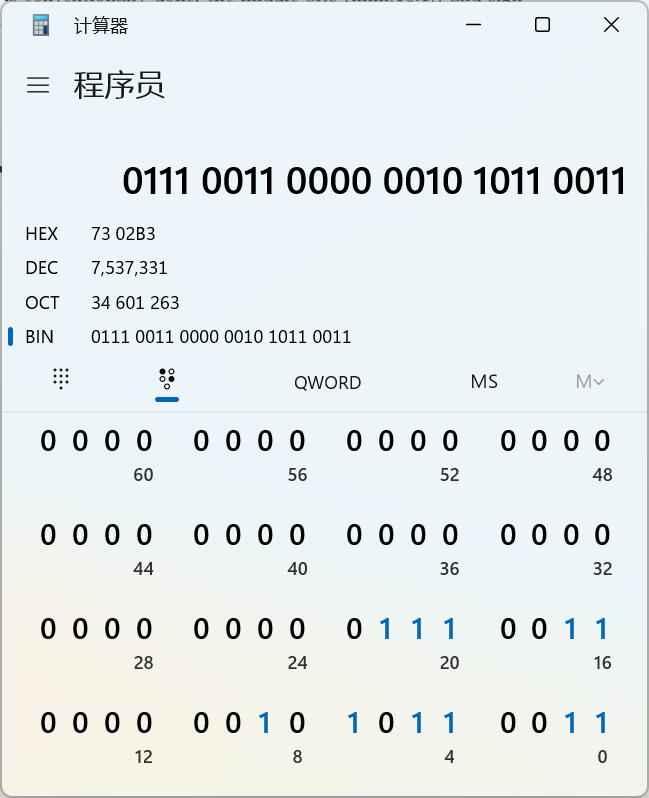
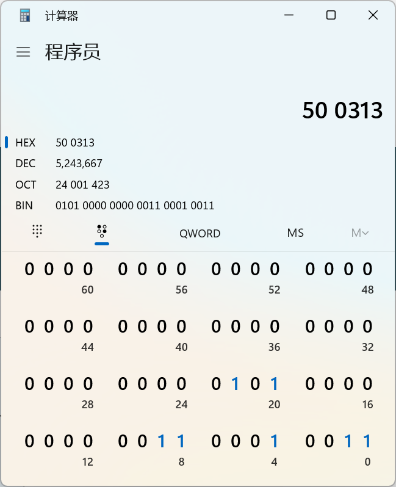
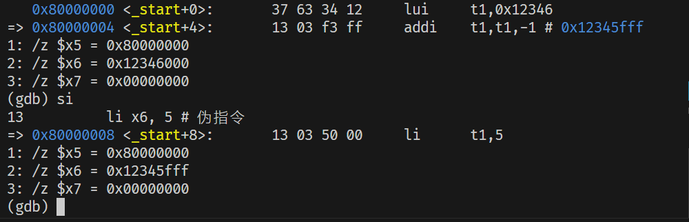

一条典型的RISC-V汇编语句

[label:] [operation] [comment]

方括号表示可选 三个都带方括号表示 支持空行

**label 标号 任何以冒号结尾的标识符都是标号**

label就像是一个地址

**operation 有以下多种类型：**

- instruction 指令 直接对应二进制字符串

- pseudo-instruction 伪指令 为了提高代码效率，可以用一条伪指令指示汇编器产生多条实际的指令

- directive 指示 伪操作 通过类似指令的形式 以.开头 通知汇编器如何控制代码的产生等 不控制代码产生 属于汇编器定义的语法

- macro 采用.macro/.endm自定义的宏 弹幕说 类似于inline

**注释** 常见的方式是#开始到当前行结尾

例子：

```assembly
# First RISC-V Assemble Sample

.macro do_nothing	# directive
	nop		# pseudo-instruction
	nop		# pseudo-instruction
.endm			# directive

	.text		# directive
	.global _start	# directive
_start: 		# Label
	li x6, 5	# pseudo-instruction
	li x7, 4	# pseudo-instruction
	add x5, x6, x7	# instruction
	do_nothing	# Calling macro
stop:	j stop		# statement in one line Label

	.end		# End of file

```

**指令总览**

寄存器有32个通用寄存器

x0-x31 

Hart在执行算数逻辑运算的时候所操作的数据必须来自寄存器


R-type 用于 寄存器—寄存器 操作

I-type 用于 短立即数 和 访存load 操作

S-type 用于 访存store 操作

B-type 用于 条件跳转 操作

U-type 用于 长立即数 操作

J-type 用于 无条件跳转

func3和func7一起决定最终的指令类型

指令在内存中按小端序排列

小端序

多字节数的低位在内存的低位


_fisrt中的demo.s 查看反汇编：

```assembly
_start: # 标签
    li x6, 5 # 伪指令
80000000:       00500313                li      t1,5
    li x7, 8 # 伪指令
80000004:       00800393                li      t2,8
    add x5, x6, x7 # 指令
80000008:       007302b3                add     t0,t1,t2
    do_nothing # 调用宏
8000000c:       00000013                nop
80000010:       00000013                nop
```

看add指令



| 0000000 | rs2   | rs1   | 000  | rd    | 0110011 | ADD            |
| ------- | ----- | ----- | ---- | ----- | ------- | -------------- |
| 0000000 | 00111 | 00110 | 000  | 00101 | 0110011 | add x5, x6, x7 |

看伪指令li x6, 5



| imm[11:0]    | rs1   | 000  | rd    | 0010011 | ADDI    |
| ------------ | ----- | ---- | ----- | ------- | ------- |
| 000000000101 | 00000 | 000  | 00110 | 0010011 | li x6,5 |

可以看出来加载立即数5到寄存器6实际上就是 addi x6, x0, 5

就是让立即数和0号寄存器相加的值存入rd中

看伪指令nop

00000013写作二进制就是0000 0000 0000 0000 0000 0000 0001 0011

实际上就是 addi x0, x0, 0

课件里列出的伪指令：

| 伪指令 | 语法       | 等价指令       | 等价描述         | 例子       |
| ------ | ---------- | -------------- | ---------------- | ---------- |
| NEG    | NEG rd, rs | sub rd,x0,rs   | 取反             | neg x5, x6 |
| MV     | MV rd, rs  | ADDI RD, RS, 0 | RS中的值拷贝到RD | mv x5, x6  |
| NOP    | NOP        | ADDI x0, x0, 0 | 什么也不做       | nop        |


可以看到立即数参与运算的指令中

立即数的范围是12位 如果想构造更大的数字

就要通过lui指令存入数字的高20位

再用addi指令加上这个数字的低12位

注意 如果想构造0x12345FFF这个数字

不能

```assembly
lui x1, 0x12345
addi x1, x1, 0xFFF
```

因为0xFFF实际上是-1

要这样

```assembly
lui x1, 0x12346 # x1 = 0x12346000
addi x1, x1, -1 # x1 = 0x12345FFF
```


为了降低构造立即数的工作量

使用li伪指令即可 他可以自动生成正确的真实指令


